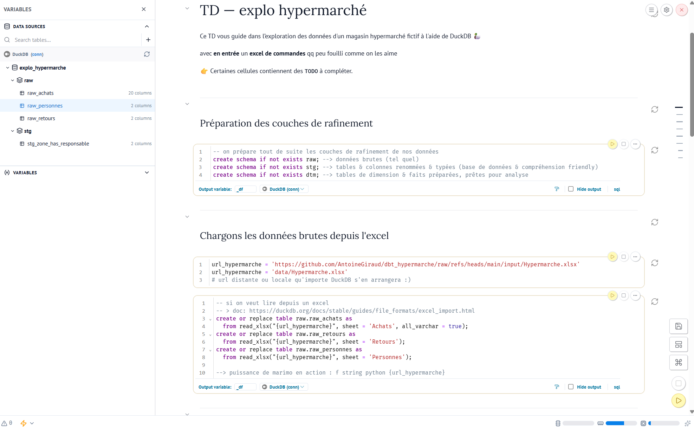
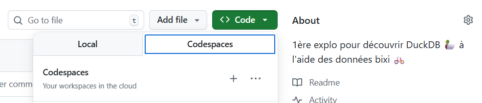

# TD — explo hypermarché

Ce TD vous guide dans l’exploration des données d'un magasin hypermarché fictif à l'aide de DuckDB 🦆

avec en entrée un **excel de commandes** qq peu fouilli "comme on les aime"

👉 Certaines cellules contiennent des `TODO` à compléter.




## Installation locale & commandes

<details>
<summary>Récupérer les outils <a href="https://git-scm.com/install/windows">git</a>, <a href="https://code.visualstudio.com/Download">VS Code</a> et <a href="https://docs.astral.sh/uv/getting-started/installation/">uv</a></summary>

- [git](https://git-scm.com/install/windows) ou
  `winget install --id Git.Git -e --source winget`\
  Dire à **git** qui vous êtes
  ```shell
  git config --global user.name "PrenomNom"
  git config --global user.email votresuper@email.fr
  ```
- [uv](https://docs.astral.sh/uv/getting-started/installation/) ou
  `powershell -ExecutionPolicy ByPass -c "irm https://astral.sh/uv/install.ps1 | iex"`
- [VS Code](https://code.visualstudio.com/Download) ou [windows store](https://apps.microsoft.com/detail/xp9khm4bk9fz7q?hl=fr-FR&gl=FR)

</details>

<details>
<summary>Rappel git clone</summary>

```bash
cd ~/votreDossierDeTravailPréféré

# copie local du répo
git clone https://github.com/AntoineGiraud/marimo_hypermarche.git

# aller dans le dossier récupéré
cd marimo_hypermarche
```
</details>

<details>
<summary>Astuces de développement (uv sync, venv)</summary>

- `uv sync`
  - télécharge **python** <em style="color: grey">si non présent</em>
  - initialise un environnement virtuel python (venv) <em style="color: grey">si non présent</em>
  - télécharge les dépendances / extensions python
- `.venv/Scripts/activate.ps1` (unix `source .venv/bin/activate`)\
  Rend la commande **streamlit** disponible dans le terminal
    - si erreur d'autorisation `PowerShell` :\
    `Set-ExecutionPolicy -ExecutionPolicy RemoteSigned -Scope CurrentUser`

</details>

#### Explorer DuckBD avec Marimo

```bash
# `uv run` optionel si venv activé !
uv run marimo edit marimo_hypermarche.py
```

## Alternative sans installation via les codespaces

Lancez un codespace Github



Une fois connecté, lancez le notebook marimo & débuter le TD
```
uv run marimo edit marimo_hypermarche.py
```